# Architecture Flows

This document describes how the current NewLeaf implementation is intended to flow end to end. It complements the broader design in [end-to-end-api-solution.md](end-to-end-api-solution.md).

## Runtime Shape

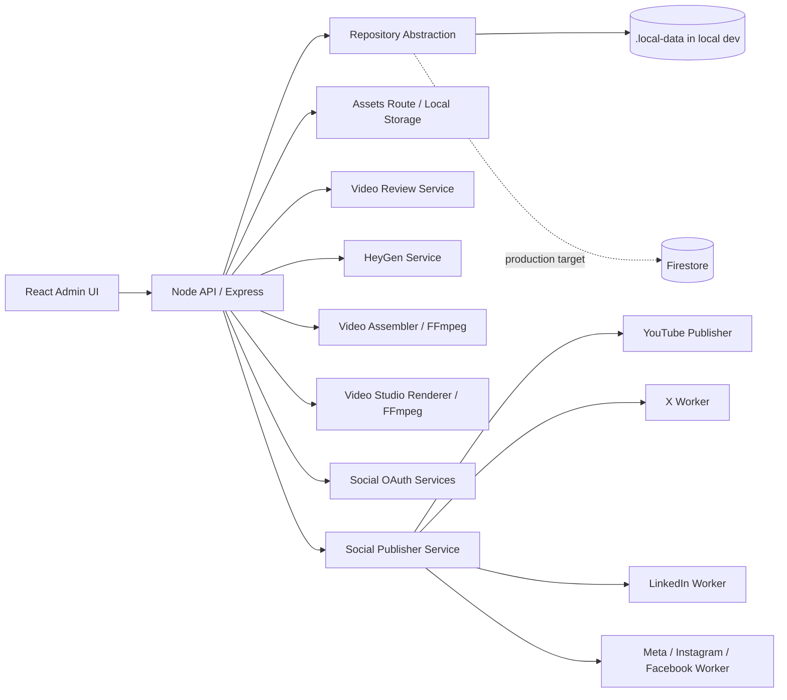

The API is the only component that talks to vendors. The admin UI consumes `/api/v1` routes and renders normalized operational state.

## API-Driven Async Product Strategy

NewLeaf product flows are API-driven and asynchronous. Frontend apps submit intent, receive a durable state record, and then render status from the API. They should not wait for provider or backend work to finish inside a long browser request.

Core split:

- Admin-web is the control plane. It creates, approves, queues, retries, cancels, and publishes work, then shows what is queued, failed, partially failed, and published.
- Client-web is mostly read-only. It renders published recommendations, reports, cards, videos, and market data from `api.newleafsystem.com`.
- Client-web writes are limited to user-owned product surfaces, such as portfolio creation, workbench settings, strategy-builder drafts, and user watchlists. Shared publication, recommendation, email, PDF, and video state remains backend-owned.
- API services own queues, locks, idempotency, provider credentials, retry state, and audit metadata.

Long-running channels return state, not final completion:

```text
Admin/client intent -> API creates durable state -> worker/provider fanout -> API updates status -> UI reads status
```

## External Service Submission Flow

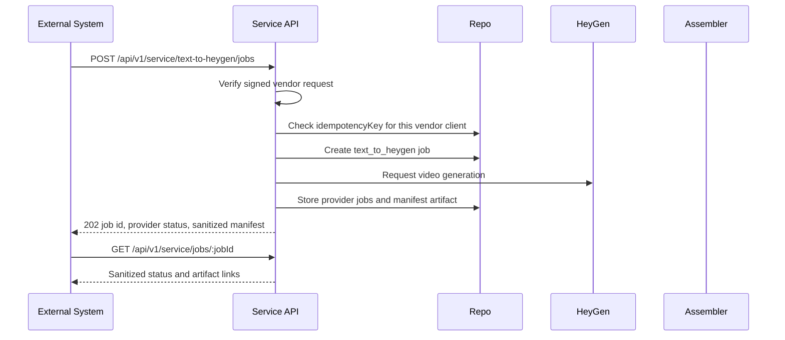

Service API rules:

- Use server-to-server calls only. Do not put service keys in browser code.
- Vendor clients are created in the Vendors admin page and authenticate with signed requests.
- The legacy `SERVICE_API_KEY_HASHES` path is kept for local scripts only.
- The service response is sanitized and does not expose provider request payloads, local file paths, OAuth tokens, or secrets.
- Use `idempotencyKey` for retries so one client retry does not create duplicate HeyGen jobs.

## Content Creation Flow

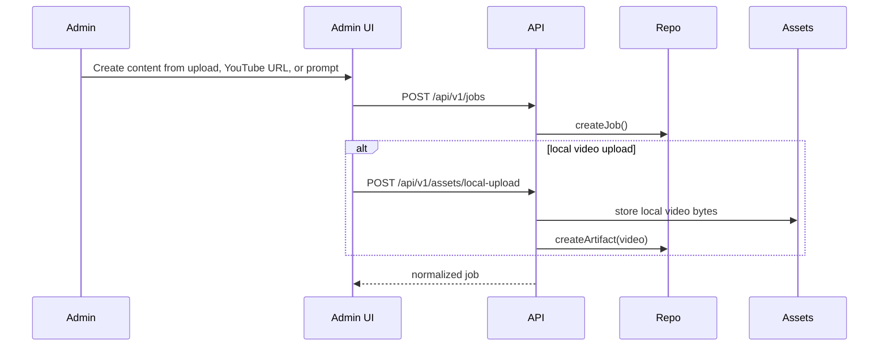

Main records:

- `job`: source, status, owner, title, and workflow metadata.
- `artifact`: source files, generated video, transcript, captions, thumbnails, or payload snapshots.

## Picks Recommendation Publishing Flow

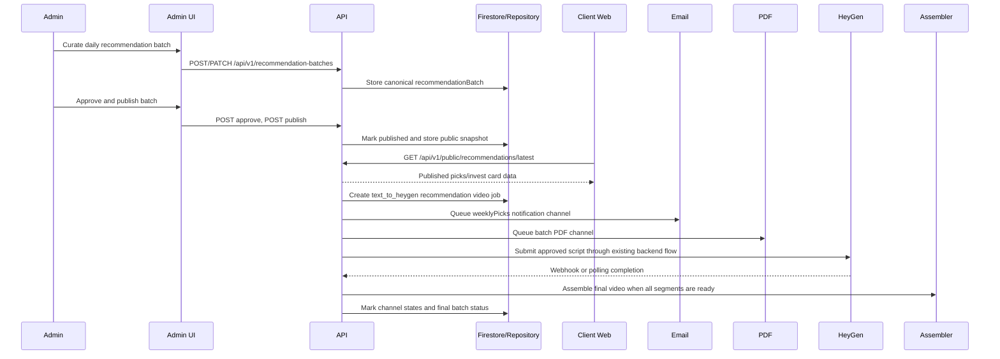

Channel ownership:

- Firestore is the canonical source for the approved recommendation batch and audit state.
- R2 or public storage is a delivery/cache layer for client-web cards, not the only source of truth.
- The first implemented public surface is the API recommendation route; storage cache generation can be added later without changing the client contract.
- Live-site cards, email, PDF, script, and HeyGen video all derive from the same stable `recommendationBatchId`.
- Email recipients are resolved from user notification preferences, not ad hoc recipient lists.
- Video generation must reuse the existing backend HeyGen flow; the admin UI never calls HeyGen directly.

## HeyGen Generation Flow

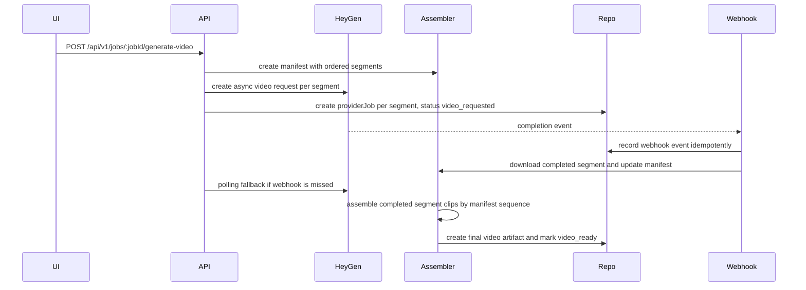

Rules:

- Webhooks are the primary completion signal.
- Polling is the fallback for missed or delayed events.
- Provider events must be deduplicated.
- Multi-clip jobs must assemble by manifest `sequence`, not webhook or polling completion order.
- Local development can use the authenticated dev completion endpoint instead of real HeyGen callbacks.
- The final video should be copied into NewLeaf-owned storage before publishing.

## Review Flow

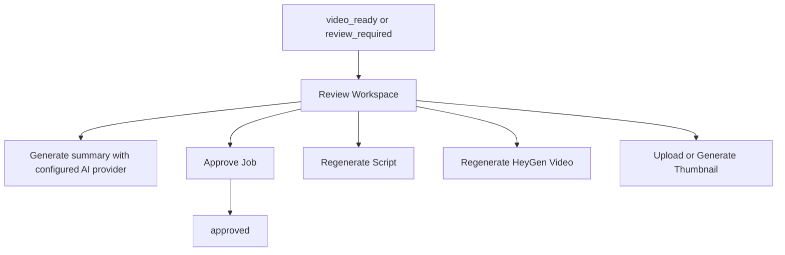

Review expectations:

- Local uploads and YouTube embeds should show video preview and summary controls.
- Thumbnails can be manually uploaded for any source or generated from the current local video artifact with FFmpeg.
- Script/video regeneration is only for generated script or HeyGen-backed jobs.
- Text-to-HeyGen review scripts are editable. Admin edits are saved through the API and reused as the prompt when regenerating the video.
- Published jobs should move out of the normal review queue.

## Video Studio Flow

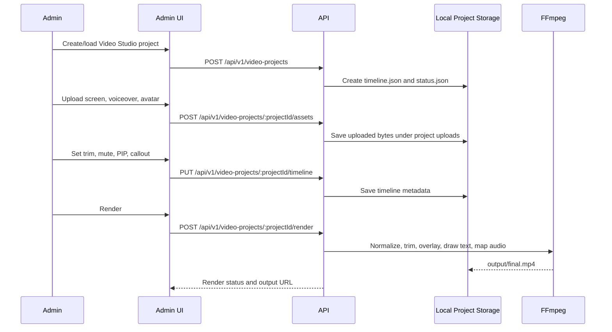

The timeline JSON is the source of truth. Uploaded files are immutable inputs for the MVP; FFmpeg only writes temporary render files and the final MP4.

## Publishing Flow

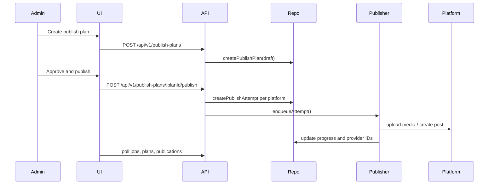

State ownership:

- `publishPlan.status` describes the overall plan.
- `publishAttempt.status` describes one platform execution.
- `publishAttempt.metadata` stores progress labels, bytes, account metadata, provider snapshots, privacy, title, tags, thumbnails, and operational notes.

## Published Library Flow

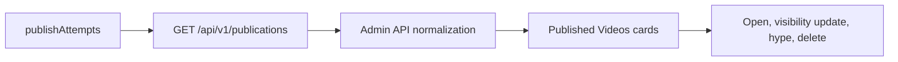

The Published Videos page is the operational library for active and deleted provider records. Active records are shown as compact video cards. Deleted records remain visible through filters as audit records.

## Publication Channel Sync Flow

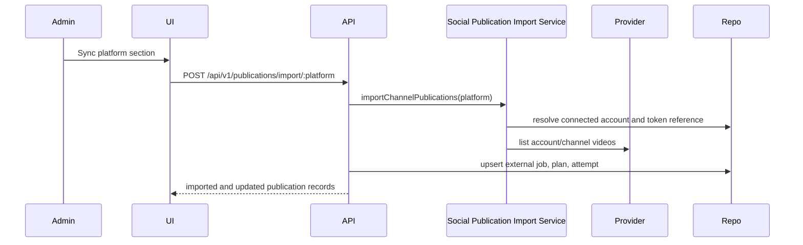

Purpose:

- Bring existing social channel videos into NewLeaf even when they were not uploaded by this app.
- Keep provider IDs and URLs aligned so later visibility edits and deletes can target the correct video.
- Avoid duplicate local records by matching provider post IDs.

Current sync support is modular:

- YouTube uses the YouTube publisher importer and Data API upload playlist flow.
- X imports video or animated GIF posts from the authenticated user's posts.
- LinkedIn imports owner posts with video media.
- Facebook imports Page videos.
- Instagram imports professional account videos and reels.

## Account Connection Flow

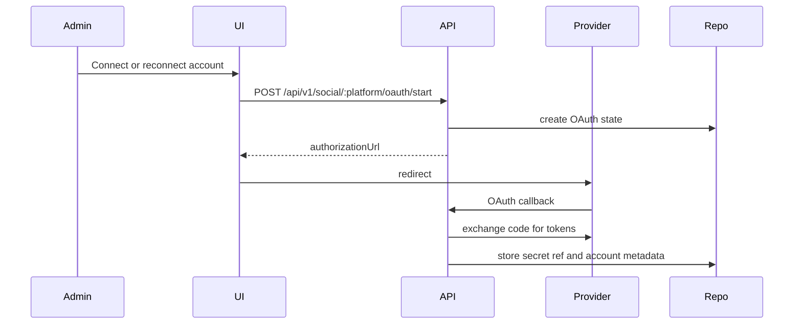

Provider-specific OAuth code belongs in backend services. The UI should only start the flow and display account health.

## Delete And Visibility Update Flow

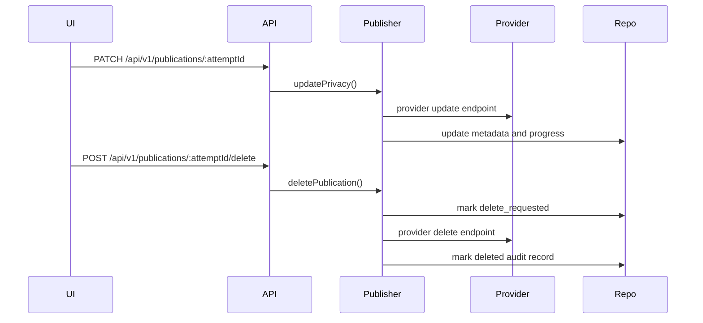

Deleting from a provider does not remove the NewLeaf audit record. This prevents loss of operational history.

## Production Target

Local development currently uses the in-memory repository with local persistence. Production should replace local persistence with:

- Firestore for jobs, artifacts, provider jobs, publish plans, attempts, accounts, smart collections, and audit logs.
- Google Secret Manager for OAuth refresh tokens and API keys.
- Cloud Tasks or Pub/Sub for async workers.
- Firebase Storage / Google Cloud Storage for canonical assets.
