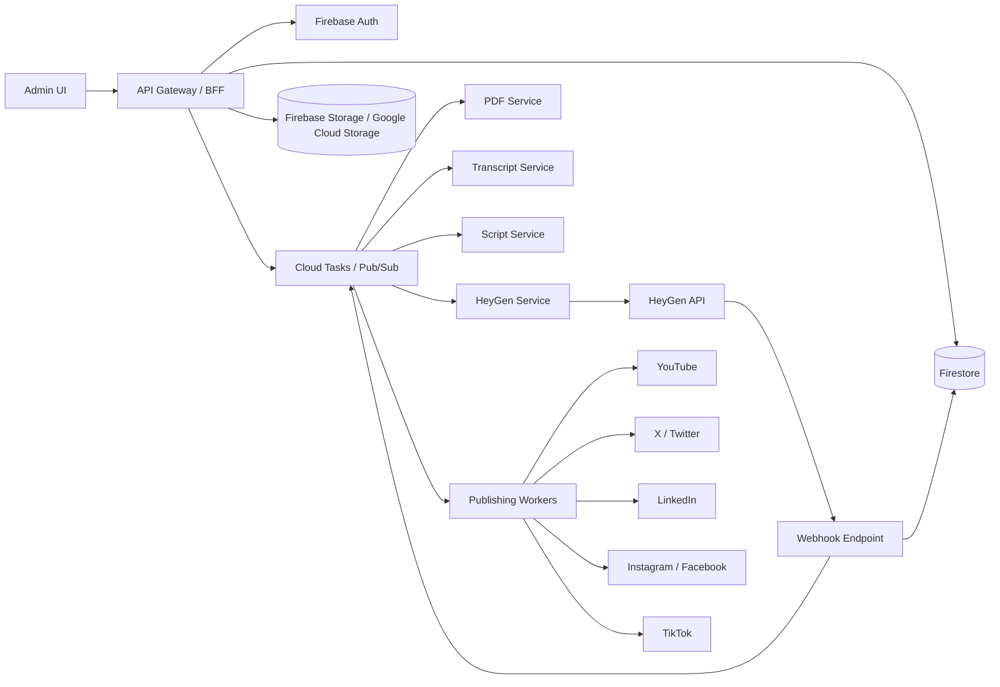

# NewLeaf End-to-End API Solution

This document describes an API-first system for generating PDFs, consuming PDFs, creating transcripts, consuming transcripts, generating AI videos through HeyGen, reviewing the output, and publishing approved videos to social channels from an admin UI.

The current workspace only contains sample artifacts:

- `BABA-Iron-Condor-20260501.pdf`
- `BABA-video-script.md`
- `newleaf_logo 2.png`

That sample points to a finance/trading content workflow, so the design below includes human review, disclaimers, audit logs, and controlled publishing.

## Recommendation

Use a split architecture:

- Firebase Auth + Firestore as the source of truth for users, jobs, approvals, publishing status, and audit history.
- Cloud Run or Firebase Functions v2 for Node.js services that need heavier runtime support: PDF parsing/rendering, browser-based PDF generation, transcript generation, FFmpeg, video download, thumbnail extraction, and social upload workers.
- Firebase Hosting and Cloud Run for public webhooks, API gateway routes, request validation, and admin API calls.
- Firebase Storage / Google Cloud Storage for canonical assets.
- Cloud Tasks or Pub/Sub for asynchronous work. If Firestore is the system of record, Cloud Tasks is the simpler first choice.

Do not make the admin UI directly call HeyGen or social APIs. The UI should call your API, and the backend should own vendor credentials, retries, polling, webhook verification, and publishing state.

## High-Level Architecture



## Content Lifecycle

Every piece of content should move through a state machine instead of scattered flags.

1. `draft`
   - Admin uploads a PDF, video, transcript, or structured data.
   - API creates a `contentJobs/{jobId}` document.

2. `source_ingested`
   - PDF/video/transcript is stored as an immutable source artifact.
   - Metadata is extracted: title, ticker/topic, duration, page count, language, source type.

3. `content_extracted`
   - PDF text, charts, tables, or transcript text is normalized.
   - Store extracted text separately from source files.

4. `script_ready`
   - Script is generated in a structured format, not only Markdown.
   - Store scenes, narration, on-screen text, citations, disclaimers, and target duration.

5. `video_requested`
   - Backend calls HeyGen and stores `heygenVideoId`, `callbackId`, `providerJobId`, and payload snapshot.
   - Job waits for webhook or fallback polling.

6. `video_ready`
   - Webhook or poller confirms success.
   - Backend downloads the video and stores a canonical copy.
   - Generate thumbnail, captions, metadata drafts, and platform-specific variants.

7. `review_required`
   - Admin reviews video, transcript, caption, title, thumbnail, disclaimers, and social targets.
   - Admin can upload a custom thumbnail or generate one from the current local video artifact with FFmpeg.
   - Admin can edit, regenerate script, regenerate video, or approve.

8. `approved`
   - Content is locked for publishing except platform-specific metadata changes.

9. `publishing`
   - A publish plan fans out into one publish attempt per platform/account.
   - Each attempt is idempotent and retryable.

10. `published`, `partial_failed`, or `failed`
   - Store public URLs, provider IDs, processing states, errors, and retry decisions.

## Core Services

### API Gateway / Backend-for-Frontend

Runtime: Node.js with Express, Fastify, or Hono.

Responsibilities:

- Firebase Auth verification and role checks.
- Admin UI API routes.
- Job creation and state transitions.
- Signed upload/download URLs.
- OAuth start/callback routes for social channels.
- Webhook registration and secret management.
- Publishing approvals and audit log writes.

### PDF Service

Responsibilities:

- Generate PDFs from HTML templates, reports, or structured trade analysis.
- Parse uploaded PDFs into text and page-level metadata.
- Extract tables and images when needed.
- Store source PDF and extracted content as separate artifacts.

Implementation notes:

- Use Cloud Run for browser-based PDF generation with Playwright or Puppeteer.
- Use `pdfjs-dist`, `pdf-parse`, or a stronger document AI service depending on PDF complexity.
- Do not use Cloudflare Workers for Chromium-based rendering or heavy PDF extraction.

### Transcript Service

Responsibilities:

- Accept uploaded transcript text, SRT, VTT, or generated transcript requests.
- Generate transcript from uploaded video/audio using a speech-to-text provider.
- Normalize transcript into timed segments.
- Produce captions for each platform.

Data shape:

```json
{
  "language": "en",
  "source": "generated",
  "segments": [
    {
      "startMs": 0,
      "endMs": 4200,
      "speaker": "narrator",
      "text": "Welcome to NewLeaf System."
    }
  ]
}
```

### Script Service

Responsibilities:

- Convert source PDF/transcript/data into a video script.
- Generate scene plan, narration, on-screen text, visual notes, and disclaimers.
- Keep script structured so it can feed HeyGen, PDF exports, and admin editing.

Recommended output:

```json
{
  "title": "BABA Iron Condor",
  "targetDurationSec": 240,
  "disclaimer": "Educational content, not financial advice.",
  "scenes": [
    {
      "sceneNo": 1,
      "durationSec": 30,
      "heading": "The Trade",
      "narration": "Welcome to NewLeaf System...",
      "visualNotes": ["Show ticker, price, and strategy summary"],
      "onScreenText": ["BABA", "Iron Condor", "80% probability of success"]
    }
  ]
}
```

### HeyGen Service

Responsibilities:

- Create videos from approved scripts.
- Store the exact request payload for reproducibility.
- Register/maintain webhook endpoint subscriptions.
- Verify HeyGen webhook signatures.
- Poll HeyGen as a fallback for jobs that do not receive a webhook.
- Download completed videos into your own storage.

Use both webhook and polling:

- Webhook is the primary completion signal.
- Polling is the safety net for missed, delayed, or failed webhook delivery.
- Idempotency key: `provider + eventType + videoId + callbackId`.

HeyGen operational notes:

- HeyGen supports asynchronous video generation and status polling.
- HeyGen webhook events include success/failure events such as `avatar_video.success`, `avatar_video.fail`, `video_agent.success`, and `video_agent.fail`.
- HeyGen webhook registration returns a secret; verify the raw body HMAC signature before accepting the event.
- Their validation can send an `OPTIONS` request with a one-second timeout, so the webhook endpoint must answer quickly.

### Publishing Workers

Each platform should be an adapter behind a common interface.

```ts
interface Publisher {
  platform: string;
  validate(plan: PublishPlan): Promise<ValidationResult>;
  publish(attempt: PublishAttempt): Promise<PublishResult>;
  refreshStatus?(attempt: PublishAttempt): Promise<PublishStatus>;
}
```

Common responsibilities:

- Refresh OAuth tokens.
- Validate video duration, size, aspect ratio, caption length, and account permissions.
- Upload media.
- Create post.
- Poll media processing status if the platform requires it.
- Store provider IDs, URLs, and errors.

## Data Model

### `users/{uid}`

```json
{
  "email": "admin@example.com",
  "displayName": "Admin",
  "roles": ["admin", "publisher"],
  "createdAt": "timestamp",
  "lastLoginAt": "timestamp"
}
```

### `contentJobs/{jobId}`

```json
{
  "title": "BABA Iron Condor",
  "type": "trade_video",
  "status": "review_required",
  "sourceType": "pdf",
  "ownerUid": "uid",
  "currentScriptId": "scriptId",
  "currentVideoArtifactId": "artifactId",
  "targetDurationSec": 240,
  "createdAt": "timestamp",
  "updatedAt": "timestamp"
}
```

### `contentJobs/{jobId}/artifacts/{artifactId}`

```json
{
  "kind": "source_pdf | extracted_text | script | video | thumbnail | captions",
  "storageProvider": "gcs",
  "storageKey": "jobs/jobId/video/final.mp4",
  "mimeType": "video/mp4",
  "sizeBytes": 12345678,
  "checksum": "sha256",
  "createdAt": "timestamp"
}
```

### `contentJobs/{jobId}/providerJobs/{providerJobId}`

```json
{
  "provider": "heygen",
  "status": "processing",
  "externalId": "heygen-video-id",
  "callbackId": "jobId-attemptNo",
  "requestPayloadRef": "artifacts/request.json",
  "lastPolledAt": "timestamp",
  "createdAt": "timestamp"
}
```

### `connectedAccounts/{accountId}`

```json
{
  "platform": "youtube",
  "accountName": "NewLeaf System",
  "ownerUid": "uid",
  "status": "connected",
  "scopes": ["youtube.upload"],
  "tokenSecretRef": "secret-manager-path",
  "createdAt": "timestamp",
  "updatedAt": "timestamp"
}
```

### `publishPlans/{planId}`

```json
{
  "jobId": "jobId",
  "status": "approved",
  "scheduledAt": "timestamp",
  "approvedBy": "uid",
  "platforms": ["youtube", "x", "linkedin"],
  "metadata": {
    "title": "BABA Iron Condor: Defined-Risk Trade Setup",
    "description": "Educational content, not financial advice.",
    "tags": ["BABA", "options", "ironcondor"]
  },
  "createdAt": "timestamp"
}
```

### `publishAttempts/{attemptId}`

```json
{
  "planId": "planId",
  "jobId": "jobId",
  "platform": "youtube",
  "connectedAccountId": "accountId",
  "status": "published",
  "providerPostId": "youtubeVideoId",
  "providerUrl": "https://youtube.com/watch?v=...",
  "errorCode": null,
  "errorMessage": null,
  "attemptNo": 1,
  "createdAt": "timestamp",
  "updatedAt": "timestamp"
}
```

### `smartCollections/{collectionId}`

```json
{
  "name": "Ready for Review",
  "description": "Active jobs waiting for reviewer action.",
  "type": "content_jobs",
  "status": "active",
  "visibility": "team",
  "ownerUid": "uid",
  "criteria": {
    "status": ["review_required"]
  },
  "sort": {
    "field": "updatedAt",
    "direction": "desc"
  },
  "columns": ["title", "status", "updatedAt"],
  "createdBy": "uid",
  "createdAt": "timestamp",
  "updatedAt": "timestamp"
}
```

### `auditLogs/{auditId}`

```json
{
  "actorUid": "uid",
  "action": "approve_publish_plan",
  "resourceType": "publishPlan",
  "resourceId": "planId",
  "before": {},
  "after": {},
  "createdAt": "timestamp"
}
```

## API Surface

Use `/api/v1` from the start so future app or partner integrations do not depend on internal UI routes.

### Assets

- `POST /api/v1/assets/upload-url`
- `GET /api/v1/assets/:artifactId/download-url`

### Jobs

- `POST /api/v1/jobs`
- `GET /api/v1/jobs`
- `GET /api/v1/jobs/:jobId`
- `PATCH /api/v1/jobs/:jobId`
- `POST /api/v1/jobs/:jobId/extract`
- `POST /api/v1/jobs/:jobId/generate-script`
- `POST /api/v1/jobs/:jobId/generate-pdf`
- `POST /api/v1/jobs/:jobId/generate-video`
- `POST /api/v1/jobs/:jobId/regenerate-video`
- `POST /api/v1/jobs/:jobId/thumbnail/upload`
- `POST /api/v1/jobs/:jobId/thumbnail/generate`
- `POST /api/v1/jobs/:jobId/approve`

### External Service API

- `GET /api/v1/service/docs`
- `GET /api/v1/service/openapi.yaml`
- `POST /api/v1/service/text-to-heygen/jobs`
- `GET /api/v1/service/jobs/:jobId`
- `GET /api/v1/service/jobs/:jobId/artifacts/:artifactId/content`

The docs routes expose Swagger UI and the raw OpenAPI contract for vendors, but they are not anonymous; they require either an approved admin Firebase bearer token, an approved admin session cookie, or valid vendor service credentials. Browser SSO works through the `newleafsystem.com` custom-domain routes only; raw Cloud Run `run.app` URLs still require explicit bearer or vendor credentials. Operational service routes are for backend-to-backend integrations. They use managed signed vendor clients or hashed local service API keys and sanitized responses, not admin Firebase credentials.

### Webhooks

- `OPTIONS /api/v1/webhooks/heygen`
- `POST /api/v1/webhooks/heygen`
- `POST /api/v1/webhooks/social/:platform`

### Publishing

- `POST /api/v1/publish-plans`
- `GET /api/v1/publish-plans/:planId`
- `POST /api/v1/publish-plans/:planId/approve`
- `POST /api/v1/publish-plans/:planId/publish`
- `POST /api/v1/publish-attempts/:attemptId/retry`
- `GET /api/v1/publications`

### Social Accounts

- `GET /api/v1/social/accounts`
- `POST /api/v1/social/:platform/oauth/start`
- `GET /api/v1/social/:platform/oauth/callback`
- `DELETE /api/v1/social/accounts/:accountId`

## Admin UI

The admin UI should be a real operations console, not a marketing page.

Recommended pages:

- Dashboard: counts by status, failed jobs, waiting approvals, scheduled publishes.
- Content Queue: searchable list of PDFs, scripts, videos, and publishing state.
- Job Detail: source preview, extracted text, transcript, script editor, scene editor, HeyGen status, video preview.
- Review Workspace: compare source PDF, generated script, final video, captions, thumbnail, and disclaimer.
- Regeneration Panel: regenerate script only, regenerate selected scenes, or regenerate full video.
- Publishing Plan: choose platforms/accounts, captions, titles, tags, thumbnails, schedule, and privacy.
- Publications: all published videos with platform URLs, post IDs, status, and retry controls.
- Connected Accounts: OAuth status, scopes, token health, reconnect controls.
- Audit Log: approvals, edits, regenerations, publishes, failures, and manual overrides.

Roles:

- `admin`: everything.
- `editor`: upload, edit script, regenerate.
- `reviewer`: approve or reject.
- `publisher`: connect accounts and publish.
- `viewer`: read-only.

## Platform Publishing Notes

Build platform adapters incrementally. Social APIs have app review, OAuth, rate limits, media restrictions, and frequent policy changes.

### YouTube

- Use YouTube Data API `videos.insert` for upload.
- Requires OAuth scope such as `https://www.googleapis.com/auth/youtube.upload`.
- Supports video upload with metadata including title, description, tags, privacy, publish time, and synthetic media declaration.
- New or unaudited API projects may have uploaded videos restricted to private visibility until Google audit approval.

### X / Twitter

- Use X API media upload before creating the post.
- Video upload uses a chunked flow: initialize, append chunks, finalize, then check status if processing is pending.
- Store `media_id` and processing state before creating the final post.

### LinkedIn

- Use LinkedIn Videos API for organization or person-owned videos.
- Flow is initialize upload, upload one or more video parts, finalize upload, then publish/share using the returned video URN.
- Preserve upload ETags because LinkedIn uses them during finalize.

### Instagram / Facebook

- Use Meta Graph API through a backend worker.
- Instagram publishing generally requires a professional Instagram account linked to a Facebook Page.
- Reels/feed publishing is a create-container then publish-container flow.
- Keep this adapter behind feature flags because Meta permissions and app review can block production use.

### TikTok

- Use TikTok Content Posting API for direct post or inbox flow.
- Direct public posting requires audit approval; unaudited clients can be restricted to private visibility.
- Some flows send content to the user's TikTok inbox for final manual completion.

## Webhook and Polling Strategy

Webhook handler rules:

- Respond to `OPTIONS` quickly.
- Read raw body before JSON parsing.
- Verify signature with the vendor secret.
- Deduplicate by idempotency key.
- Store raw event in `webhookEvents`.
- Enqueue work and return 2xx quickly.

Poller rules:

- Poll `providerJobs` in `processing` state.
- Use exponential backoff and provider-recommended polling intervals.
- Stop after terminal states: `success`, `failed`, `cancelled`, `expired`.
- Alert if a job is stuck beyond the expected SLA.

Retry rules:

- Retries must be idempotent.
- Never create duplicate public posts for the same `publishAttempt`.
- Store provider request and response snapshots for debugging.
- Use dead-letter queues for repeated failures.

## Security

- Firebase Auth for admin identity.
- Firebase custom claims or Firestore role documents for authorization.
- Store API keys and OAuth refresh tokens in Secret Manager, not Firestore plaintext.
- Encrypt any token metadata that must be searchable.
- Use signed URLs for admin asset access.
- Use short-lived public URLs for provider pulls when supported.
- Verify all webhooks.
- Add rate limiting on public endpoints.
- Store audit logs for every approval, edit, regeneration, and publish.
- Separate development, staging, and production Firebase / Google Cloud projects.

## Deployment Shape

Suggested repository layout:

```text
apps/
  admin/
    React or Next.js admin UI
  api/
    Node.js API gateway / BFF
services/
  pdf/
  transcript/
  script/
  heygen/
  publishing/
packages/
  core/
    shared schemas, errors, auth, logging
  publishers/
    youtube, x, linkedin, instagram, tiktok adapters
infra/
  firebase/
  google-cloud/
  terraform-or-pulumi/
docs/
```

MVP deployment:

- Admin UI: Firebase Hosting.
- API: Cloud Run Node.js service.
- Jobs: Cloud Tasks + Cloud Run workers.
- Database: Firestore.
- Assets: Firebase Storage / Google Cloud Storage.
- Webhooks: Cloud Run endpoint first.

## MVP Build Plan

### Phase 1: Foundation

- Firebase project, Auth, Firestore, and Storage.
- Node.js API scaffold.
- Admin login and role model.
- Job creation, file upload, artifact storage.
- Audit logs.

### Phase 2: PDF and Script Workflow

- PDF upload and extraction.
- PDF generation from structured input.
- Script schema and script editor.
- Script regeneration endpoint.
- Basic admin job detail page.

### Phase 3: HeyGen Video Generation

- HeyGen API client.
- Generate video endpoint.
- HeyGen webhook endpoint with signature verification.
- Polling fallback.
- Download final video into canonical storage.
- Video preview in admin UI.

### Phase 4: Review and Approval

- Review workflow.
- Regenerate controls.
- Approval locks.
- Thumbnail and caption artifact generation.

### Phase 5: Publishing MVP

- OAuth connection flow for one platform first, preferably YouTube.
- YouTube publishing adapter.
- Publish attempts and retry controls.
- Publications dashboard.

### Phase 6: Multi-Platform Publishing

- Add LinkedIn.
- Add X.
- Add Instagram/Facebook after Meta app review path is clear.
- Add TikTok after Direct Post or inbox flow is approved.
- Add scheduling, analytics sync, and comment/engagement imports.

## Current API Facts Checked

- HeyGen supports direct API key authentication, asynchronous video generation, status polling, and webhook events for video success/failure. Their current docs also state v3 is the active platform, while v1/v2 legacy endpoints remain supported through October 31, 2026 for migration planning.
- HeyGen webhook endpoint registration supports subscribed event lists and returns a webhook secret for signature verification.
- YouTube Data API `videos.insert` uploads videos and supports metadata fields such as title, description, tags, privacy, publish time, and `containsSyntheticMedia`.
- X API media upload supports video upload through a chunked initialize/append/finalize/status flow.
- LinkedIn Videos API uses initialize upload, chunk upload, finalize upload, and then publishing with the returned video URN.
- TikTok Content Posting API supports video upload/direct-post flows, but audit status affects whether content can be publicly posted.
- Cloud Tasks and Pub/Sub provide Google-native queueing, retries, delays, and dead-letter flows for Cloud Run and Firebase functions.
- Firebase Cloud Functions v2 can trigger from Firestore changes and expose HTTPS functions, and Firebase Functions includes task queue handlers for Cloud Tasks.

## Source References

- New Leaf Systems public site reference: https://newleafsystems.com/
- HeyGen quick start and active API platform notes: https://docs.heygen.com/docs/quick-start
- HeyGen video generation API: https://docs.heygen.com/reference/create-video-1
- HeyGen webhook events: https://docs.heygen.com/docs/using-heygens-webhook-events
- HeyGen webhook endpoint and signature example: https://docs.heygen.com/docs/write-your-endpoint-to-process-webhook-events
- YouTube `videos.insert`: https://developers.google.com/youtube/v3/docs/videos/insert
- X media upload docs: https://docs.x.com/x-api/media/introduction
- X chunked media upload: https://docs.x.com/x-api/media/quickstart/media-upload-chunked
- LinkedIn Videos API: https://learn.microsoft.com/en-us/linkedin/marketing/community-management/shares/videos-api?view=li-lms-2026-04
- TikTok Content Posting API upload video: https://developers.tiktok.com/doc/content-posting-api-reference-upload-video
- TikTok Direct Post API: https://developers.tiktok.com/doc/content-posting-api-reference-direct-post
- Firebase Cloud Functions Firestore triggers: https://firebase.google.com/docs/functions/firestore-events
- Firebase Functions task queue handlers: https://firebase.google.com/docs/reference/functions/2nd-gen/node/firebase-functions.tasks
